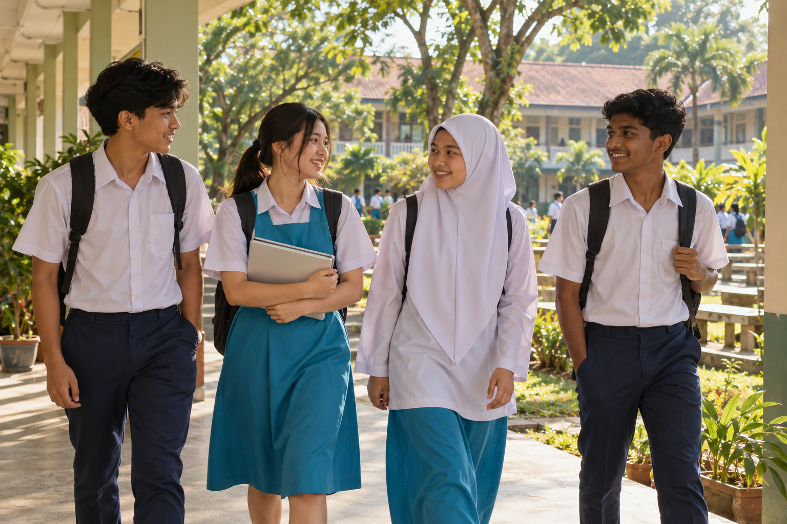
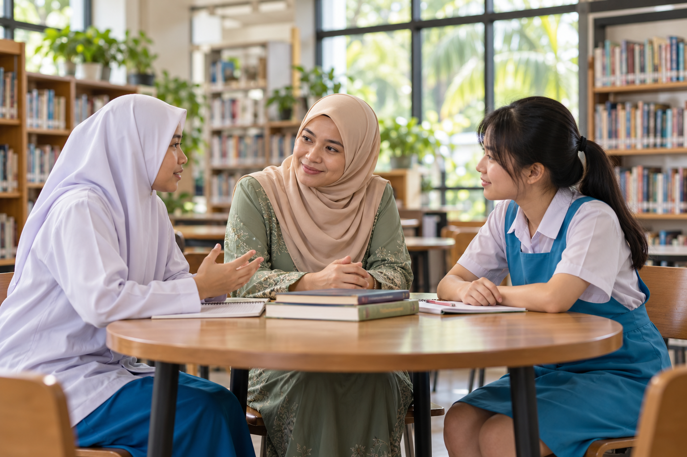
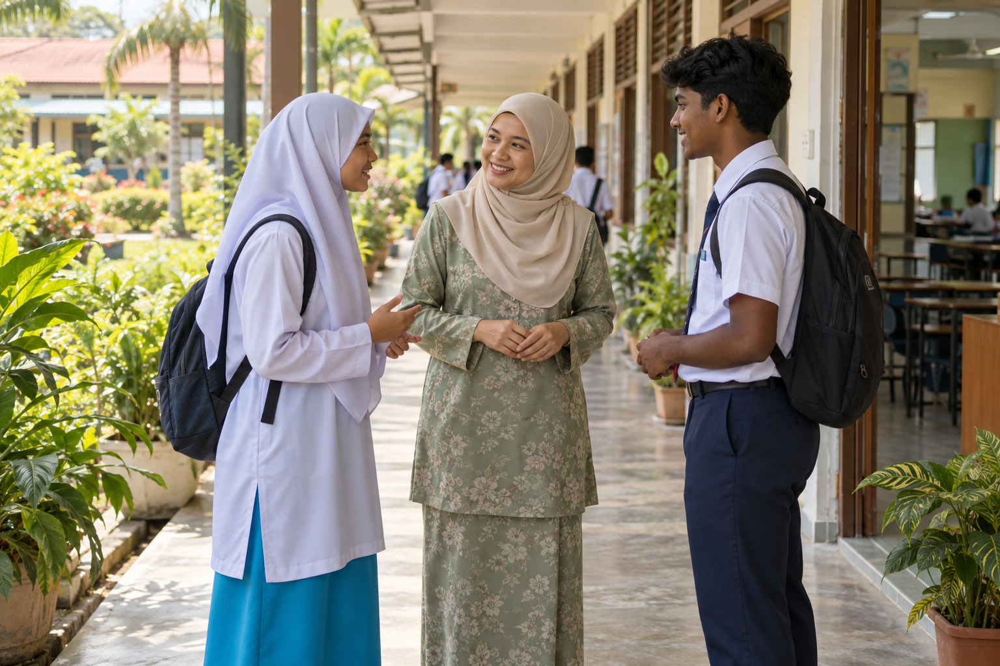
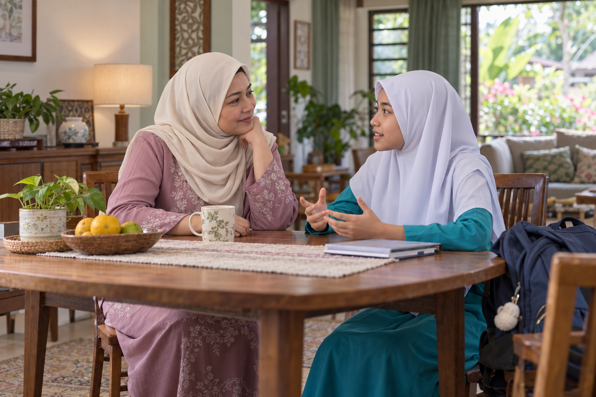
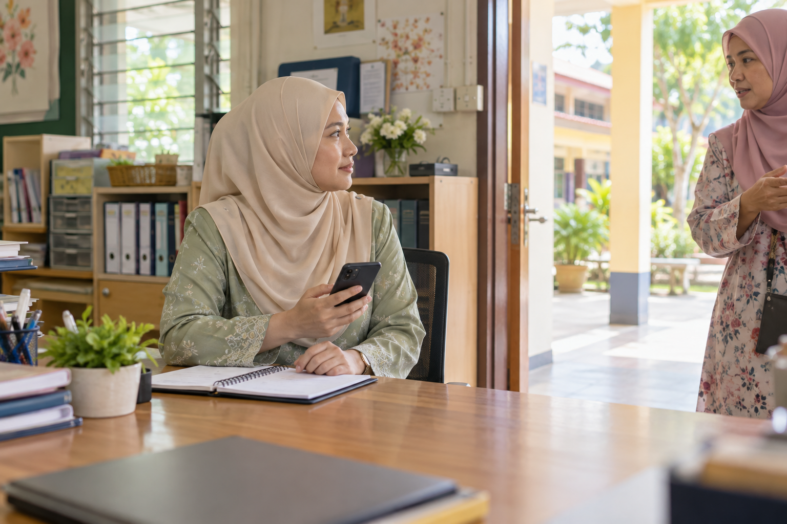

<!-- layout: cover -->
# Sekolah selamat, tempat anak-anak bertumbuh
## Mendengar dengan hati. Melindungi bersama.

Disediakan oleh

**Izzah Sofiyah binti Mohd Murtadha**

Sarjana Muda Sains Pentadbiran dan Pembangunan Tanah dengan Kepujian, Universiti Teknologi Malaysia

Ahli Dewan Muda Johor

Note:
Ampun Tuanku beribu-ribu ampun, sembah patik mohon diampun. Patik memohon perkenan Tuanku untuk mempersembahkan cadangan memperkukuh keselamatan dan kesejahteraan anak-anak di institusi pendidikan. Persembahan ini merupakan cadangan umum, bukan dapatan siasatan mana-mana kes.

---
<!-- layout: photo -->
# Kita mahu mereka datang dengan harapan, pulang dengan senyuman.

Belajar, berkawan dan membesar tanpa rasa takut.

> Rasa selamat ialah permulaan kepada pembelajaran.

Note:
Keselamatan bukan sekadar ketiadaan kecederaan. Anak-anak juga perlu bebas daripada ketakutan, penghinaan, ugutan dan pemulauan. Inilah matlamat yang sepatutnya memandu setiap pelaburan dan tindakan kita.

---
<!-- layout: photo -->
# Melihat sekolah melalui mata seorang anak
- **Di kelas** , berani bertanya.
- **Di asrama** , tahu tempat meminta bantuan.
- **Bersama rakan, juga dalam talian** , dihormati dan diterima.

> Rasa selamat bermula dalam pengalaman sehari-hari.

Note:
Laporan asal menjadi titik mula untuk memahami isu. Skop persembahan diperluas supaya tindakan boleh disesuaikan dengan pelbagai institusi, termasuk keperluan murid yang berbeza. Kita tidak menganggap semua sekolah mempunyai risiko atau sumber yang sama.

Huraian tambahan:  Perlindungan hadir dalam perkara sehari-hari  - Di kelas , berani bertanya tanpa ditertawakan. - Di asrama dan kawasan sekolah , tahu ada orang dewasa yang boleh membantu. - Dalam persahabatan dan ruang digital , dihormati, diterima dan tidak diugut.   Setiap sekolah berbeza. Keperluan untuk rasa selamat dikongsi bersama.

---
<!-- layout: photo -->
# Sebelum mencari jawapan, mari memahami.
- **Dengar** murid, keluarga dan pendidik.
- **Fahami** hubungan rakan dan keadaan sekolah.
- **Semak bukti** sebelum membuat kesimpulan.

> Memahami dahulu membuka jalan untuk membantu.

Note:
Laporan asal membincangkan dua kes serta data pendapatan, jenayah dan premis hiburan. Sampel tersebut tidak memadai untuk inferens sebab-akibat. Angka, nama dan butiran kes yang belum disahkan semula tidak diulang dalam slaid awam ini. Kita juga tidak boleh menolak pengaruh sosioekonomi hanya kerana dua daerah berbeza.

Huraian tambahan:  Di sebalik setiap kebimbangan, ada pengalaman yang perlu didengar  - Dengar suara murid, bersama pandangan keluarga dan pendidik. - Teliti keadaan sebenar: hubungan rakan, budaya sekolah dan pengawasan. - Berhati-hati membuat kesimpulan; beberapa kes belum menerangkan keseluruhan masalah.   Kita mencari jalan membantu, tanpa terburu-buru menyalahkan.

---
<!-- layout: photo -->
# Ada anak yang ingin bercerita, tetapi belum berani.

Mungkin dia bimbang tidak dipercayai. Mungkin dia takut keadaan menjadi lebih sukar.

> Langkah pertama kita: menyediakan ruang untuk didengar.

Note:
Ampun Tuanku, tidak semua anak dapat terus menyatakan apa yang dialaminya. Kita boleh membuka ruang dengan mendengar tanpa memperkecilkan perasaannya. Ketakutan untuk melapor, ruang kurang diawasi, normalisasi kekerasan dan aduan tanpa susulan ialah perkara yang dicadangkan untuk diteliti di sekolah; bukan dapatan terhadap semua institusi.

---
<!-- layout: pillars ribbon -->
# Perlindungan tumbuh apabila kita bergerak bersama
## Tiga perkara yang saling melengkapi

- **Hubungan yang dipercayai** , ada seseorang yang sudi mendengar.
- **Tindakan yang jelas** , bantuan diteruskan sehingga murid terlindung.
- **Alat yang membantu** , teknologi memudahkan kita menghubungkan kedua-duanya.

> Mulakan dengan manusia, kemudian pilih alat yang benar-benar diperlukan.

Note:
Cadangan ini meletakkan manusia dan tata kelola sebagai asas. Alat yang canggih tidak menggantikan hubungan yang dipercayai atau petugas yang mencukupi. Dana perlu menyokong keseluruhan sistem perlindungan.

---
<!-- layout: photo -->
# Kehadiran kita boleh membawa makna
## Perhatian kecil, makna yang besar

- **Bertanya khabar** dan mengenali murid.
- **Bimbing rakan menjaga rakan**, tanpa hukuman oleh senior.
- **Amalkan empati** dalam kehidupan sekolah.
- **Sokong guru dan warden** dalam amanah menjaga anak-anak.

Note:
Guru dan warden tidak boleh dipertanggungjawabkan tanpa sumber yang memadai. Pentadbir perlu menilai jadual tugas, keletihan dan laluan mendapatkan bantuan. Tindakan terhadap pelaku hendaklah adil, disertai intervensi sesuai, sambil mengutamakan keselamatan mangsa.

---
<!-- layout: photo process -->
# Apabila seorang anak mula bercerita…
- **Dengar** dengan tenang.
- **Lindungi** keselamatannya.
- **Hubungkan** dengan petugas yang membantu.
- **Susuli** sehingga bantuan sampai.

> Kepercayaan tumbuh selepas kita mendengar dan bertindak.

Note:
Kerahsiaan perlu diurus secara bertanggungjawab. Jangan menjanjikan kerahsiaan mutlak apabila bantuan perlindungan memerlukan perkongsian terhad. Jangan paksa mangsa bersemuka atau berdamai dalam keadaan tidak selamat. Aduan tanpa nama boleh dibenarkan, tetapi setiap dakwaan tetap perlu disemak secara adil.

Murid perlu mempunyai saluran alternatif jika aduan melibatkan pihak dalam rantaian pentadbiran biasa. Tetapkan petugas dan tempoh respons yang jelas.

Huraian tambahan:  Sambut keberaniannya dengan bantuan yang nyata  - Dengar dengan tenang , beri ruang, tanpa terus menyalahkan. - Pastikan dia selamat , fahami keperluan dan risiko segera. - Hubungkan dengan bantuan , tetapkan siapa yang akan bertindak. - Kembali bertanya khabar , pastikan bantuan itu benar-benar sampai.   Kepercayaan dibina melalui apa yang kita lakukan selepas mendengar.

---
<!-- layout: photo -->
# Rumah dan sekolah, satu lingkungan sokongan

Perbualan yang tenang membuka ruang untuk anak berkongsi.

**“Apa yang menggembirakan hari ini? Ada perkara yang membuat kamu tidak selesa?”**

> Cadangan pembuka bicara, bukan soal siasat.

Note:
Perubahan tingkah laku tidak dengan sendirinya membuktikan buli atau masalah tertentu. Ia alasan untuk mendengar dan mendapatkan penilaian sesuai. Komunikasi hendaklah menghormati privasi serta keadaan keluarga dan tidak menambah beban kepada mangsa.

---
# Teknologi boleh mendekatkan bantuan
## Pilih mengikut keperluan sekolah

| Apabila murid memerlukan… | Alat boleh membantu… | Orang dewasa tetap perlu… |
| --- | --- | --- |
| Ruang untuk melapor | Saluran aduan digital | Mendengar dan melindungi pengadu |
| Bantuan segera | Butang SOS | Menerima amaran dan hadir membantu |
| Kawasan lebih terjaga | Rekod rondaan, sensor terpilih | Menyemak keadaan dan bertindak |
| Perhatian berterusan | Rekod tindakan susulan | Kembali memastikan murid selamat |

Note:
Ini ialah pilihan, bukan senarai pembelian wajib. Penempatan kamera atau sensor perlu mengambil kira keperluan, privasi dan kesesuaian ruang. Sensor tanpa kamera tetap boleh menghasilkan data sensitif. Kos latihan dan penyelenggaraan perlu dinilai bersama kos perkakasan.

---
<!-- layout: photo story -->
# Bayangkan satu butang bantuan ditekan.
## Situasi rekaan untuk direnungkan bersama

Amaran sampai ke telefon petugas.

**Namun, siapa yang akan datang?**

> Alat boleh menghantar isyarat. Perlindungan memerlukan seseorang yang menyahutnya.

Note:
Bayangkan satu situasi rekaan: butang SOS berfungsi dan amaran dihantar, tetapi telefon petugas tidak dipantau atau tiada petugas gantian. Alat berjaya secara teknikal, namun perlindungan belum berlaku. Contoh ini bukan merujuk kepada mana-mana kejadian sebenar.

---
<!-- layout: photo -->
# Menjaga keselamatan, memelihara maruah
- **Jaga kerahsiaan** maklumat murid.
- **Semak amaran**; alat boleh tersilap.
- **Sediakan bantuan tanpa peranti.**
- **Elakkan label automatik** terhadap murid.

> Menjaga dengan penuh hormat.

Note:
Sebelum rintis, lakukan penilaian privasi, keselamatan, etika dan keperluan undang-undang yang terpakai. AI generatif, jika digunakan, hendaklah terhad kepada sokongan seperti latihan atau penstrukturan maklumat dengan semakan manusia. Ia bukan kaunselor kecemasan dan bukan pembuat keputusan disiplin.

Huraian tambahan:  Anak-anak juga perlu berasa dipercayai  - Ambil hanya data yang diperlukan dan jaga kerahsiaannya. - Semak setiap amaran dengan manusia; alat juga boleh tersilap. - Sediakan bantuan tanpa peranti, supaya tiada anak tertinggal. - Elakkan label automatik berdasarkan wajah, emosi atau skor risiko.   Teknologi yang baik membantu kita menjaga, dengan penuh hormat.

---
<!-- layout: photo process -->
# Kita boleh bermula, langkah demi langkah.
- **Kenali keperluan** , dengar dan fahami sekolah.
- **Cuba bersama** , sokong petugas, pilih alat yang sesuai.
- **Nilai dan perbaiki** , perluas usaha yang berkesan.

> Beri masa, latihan dan sokongan untuk perubahan bertumbuh.

Note:
Fasa ini ialah cadangan, bukan program yang telah diluluskan. Pilih institusi rintis yang mewakili bandar, luar bandar, sekolah harian dan berasrama tanpa melabel sekolah sebagai bermasalah. Tetapkan garis dasar dan kaedah penilaian sebelum pelaksanaan.

Pemilihan sekolah rintis perlu merangkumi konteks bandar, luar bandar, harian dan berasrama.

Huraian tambahan:  Cadangan untuk dilaksanakan bersama  - Kenali keperluan sekolah , dengar murid, semak pengawasan dan perjalanan aduan. - Cuba dalam skala kecil , kukuhkan petugas dan proses; tambah alat yang sesuai. - Belajar daripada pengalaman , nilai hasil, baiki kelemahan, perluas yang berkesan.   Sediakan masa, latihan dan sumber untuk mereka yang menjalankan amanah ini.

---
<!-- layout: photo -->
# Bagaimana kita tahu usaha ini membantu?
- Anak lebih **selesa bersuara**.
- Bantuan **lebih cepat sampai**.
- Ada yang **terus mengambil berat**.
- **Kejadian berulang berkurang**.

> Lihat perlindungan yang dirasai anak-anak.

Note:
Gunakan maklum balas murid secara selamat serta rekod yang dinyahkenal pasti apabila sesuai. Jangan menilai sekolah semata-mata melalui jumlah aduan yang rendah kerana ini boleh menggalakkan penyembunyian. Nilai juga beban kerja, amaran palsu dan pengalaman pengguna.

Bilangan aduan mungkin meningkat apabila kepercayaan bertambah; tafsir bersama bukti lain.

Huraian tambahan:  Lihat perubahan yang dirasai oleh anak-anak  - Lebih selesa bersuara dan tahu kepada siapa hendak meminta bantuan. - Bantuan lebih cepat sampai apabila mereka memerlukannya. - Ada yang terus mengambil berat, walaupun tindakan awal sudah selesai. - Kurang kejadian berulang, termasuk tindakan balas selepas melapor.   Ukuran terpenting ialah perlindungan yang dirasai, bukan banyaknya alat yang dipasang.

---
<!-- layout: pillars ribbon -->
# Tiga ikhtiar untuk masa hadapan mereka
## Dengan penuh takzim, dipersembahkan untuk pertimbangan

- **Perkukuh hubungan** , sokong guru, warden, kaunselor dan keluarga.
- **Pastikan bantuan sampai** , jadikan setiap aduan amanah yang disusuli.
- **Pilih teknologi dengan cermat** , uji manfaatnya sebelum diperluas.

> Usaha yang baik bermula dengan keprihatinan dan diteruskan dengan tanggungjawab.

Note:
Ampun Tuanku, patik mempersembahkan tiga keutamaan ini untuk pertimbangan. Cadangan pelaksanaan adalah untuk diteliti oleh pihak berkaitan mengikut bidang kuasa dan sumber masing-masing. Persembahan ini tidak menggambarkan perkenan atau sokongan rasmi yang telah diberikan.

---
<!-- layout: photo closing -->
# Teknologi membantu. Kasih dan tanggungjawab melindungi.

**Teknologi bukanlah penyelesaian muktamad.**

Anak-anak memerlukan manusia yang mendengar, mengambil berat dan hadir apabila diperlukan.

Sekian, sembah patik.

Note:
Ampun Tuanku, teknologi boleh mempercepatkan amaran dan memudahkan pengawasan. Namun, alat tidak boleh memikul amanah mendidik, mendengar dan bertindak. Keselamatan anak-anak ialah tanggungjawab kita bersama. Sekian, sembah patik.

---
# Asas kandungan dan batas tafsiran

- **Bahan asas:** Laporan_Kes_Pembunuhan_Sekolah_2026.md yang dibekalkan, serta draf persembahan umum.
- **Batas bukti:** butiran kes dan angka laporan asal belum disahkan semula; tidak dipersembahkan sebagai dapatan rasmi.
- **Status:** cadangan untuk perbincangan; tiada penilaian keberkesanan program atau teknologi dilakukan dalam pembentangan ini.
- **Visual:** lima ilustrasi fotografi janaan AI; bukan foto murid, institusi atau kejadian sebenar.
- **Skop:** keselamatan dan kesejahteraan murid di Malaysia; bebas daripada kepentingan institusi atau pembekal tertentu.

Note:
Slaid lampiran ini disediakan untuk sesi soal jawab. Pembentangan utama berakhir pada slaid sebelumnya. Sumber asal tidak diterbitkan bersama laman ini kerana butiran kes perlu disahkan sebelum dikongsi semula. Jika angka atau kes khusus ditambah kemudian, sertakan sumber primer dan tarikh pengesahan.
